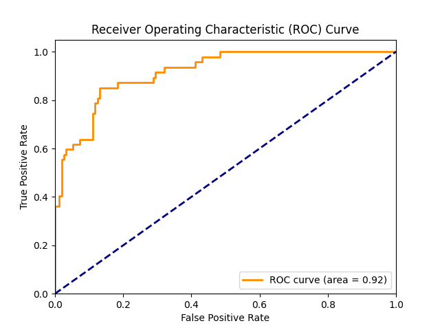

# Results
## Confusion Matrix
|            | Predicted Positive | Predicted Negative |
|------------|-------------------|-------------------|
| Actual Positive | 26 | 21 |
| Actual Negative | 3 | 150 |

## Metrics
- Precision: 0.896551724137931
- Recall: 0.5531914893617021
- Minimum False Positive Rate for at least 90% recall: 0.29411764705882354

## ROC Curve

